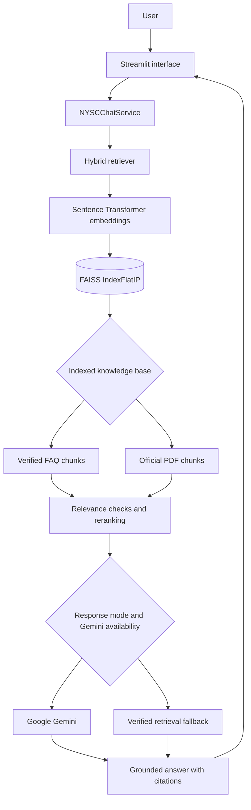
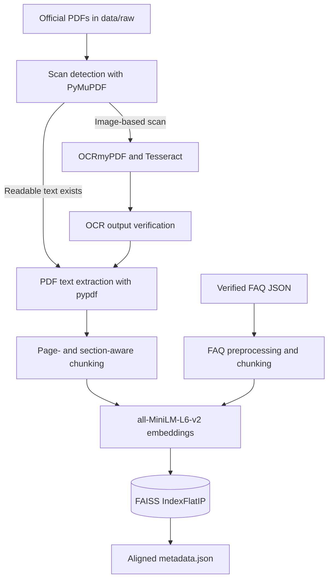

# NYSC FAQ Assistant


[](https://www.python.org/)
[](https://streamlit.io/)
[](https://github.com/facebookresearch/faiss)
[](https://ai.google.dev/)
[](https://www.sbert.net/)
[](LICENSE)


An AI-powered Retrieval-Augmented Generation (RAG) chatbot that answers National Youth Service Corps (NYSC) questions using verified FAQs and official NYSC documents. It combines semantic search, FAISS vector retrieval, offline OCR processing, retrieval reranking, and Google Gemini to deliver grounded answers with source citations.

> [!IMPORTANT]
> This is an independent educational AI project and is not affiliated with or endorsed by the National Youth Service Corps (NYSC).

## Live demo

- **Live Streamlit application:** [nysc-faq-assistant.streamlit.app](https://nysc-faq-assistant.streamlit.app/)
- **Repository:** [github.com/AnalyticPalmer/nysc-faq-chatbot](https://github.com/AnalyticPalmer/nysc-faq-chatbot)

## Project overview

NYSC information spans registration guidance, orientation requirements, portal support, official policies, Bye-Laws, and other documents. Users often need to search several sources, and exact keyword matching can miss a relevant answer when their wording differs from the source wording.

The assistant uses the `sentence-transformers/all-MiniLM-L6-v2` embedding model to represent questions and knowledge-base chunks semantically. FAISS compares normalized vectors with inner-product search, allowing the retriever to find conceptually related information rather than relying only on literal keyword matches. Retrieval reranking then considers semantic similarity, meaningful term overlap, source type, FAQ question matches, document titles, and PDF page metadata.

Grounding generation in verified FAQs and official NYSC documents reduces unsupported answers. Gemini receives a bounded set of retrieved evidence and explicit grounding instructions. When Gemini is unavailable or an external generation request fails, the application can return a relevance-checked retrieval fallback instead of abandoning the user or inventing information.

## Key features

###  AI and retrieval

- Retrieval-Augmented Generation with source-grounded prompts
- Google Gemini answer generation (`gemini-3.6-flash` by default)
- Semantic search with Sentence Transformers
- `all-MiniLM-L6-v2` normalized embeddings
- FAISS `IndexFlatIP` vector retrieval
- Hybrid retrieval reranking across FAQ and PDF evidence
- Automatic verified-retrieval fallback when Gemini is unavailable

###  Knowledge base

- Verified NYSC FAQ JSON data
- Official NYSC PDF documents
- OCR-processed NYSC Bye-Laws
- NYSC sexual harassment policy
- Registration guide for foreign-trained prospective corps members
- Page-aware and section-aware PDF source metadata

###  OCR workflow

- Offline scanned-document detection
- OCRmyPDF processing workflow
- Tesseract OCR through OCRmyPDF
- PyMuPDF-based scan inspection and OCR verification
- Readable PDFs skipped automatically by the OCR processor
- Existing OCR outputs preserved instead of being regenerated

> [!NOTE]
> `ocr_scanned_pdfs.py` imports PyMuPDF (`fitz`) and invokes OCRmyPDF, but those packages are not currently listed in `requirements.txt`. OCRmyPDF also requires a working Tesseract installation. These are optional offline ingestion prerequisites; normal Streamlit startup does not run OCR.

###  User experience

- Theme-aware light and dark interfaces
- Responsive desktop and mobile layout
- Conversation history and follow-up suggestions
- Retrieval confidence and response-time display
- FAQ and PDF source citations with page and section details
- Clickable topic navigation for 13 NYSC topics
- Quick-question shortcuts
- Conversation download
- Helpful / Not Helpful feedback controls
- Developer Mode with safe retrieval and generation diagnostics
- Local-only knowledge-base refresh control

###  Engineering

- Modular Python architecture
- Structured application logging
- Input and metadata validation
- Safe error handling and unavailable-information responses
- In-session response cache
- Source deduplication and grounding controls
- Automatic, AI Enhanced, and Verified FAQ Only response modes
- Cached Streamlit resource and dashboard loading

## System architecture



The Streamlit interface delegates questions to `NYSCChatService`, which manages conversational intent, follow-up context, session caching, retrieval, response modes, Gemini availability, and safe error responses. Retrieval searches the stored FAQ and PDF chunks, while the chat engine filters, reranks, selects context, and builds source metadata.

## Document ingestion pipeline

OCR is an offline preparation step rather than a Streamlit startup task.



The committed OCR-generated Bye-Laws PDF is also present in `data/raw`, where the vector-store builder can ingest its searchable text layer. Image-only PDFs without readable text are skipped by normal PDF loading rather than OCR-processed during application startup.

## Tech stack

| Area | Technology | Role in the project |
|---|---|---|
| Frontend | Streamlit 1.60 | Responsive chat UI, topic navigation, themes, sources, diagnostics, and session controls |
| Backend | Python | Application services, orchestration, validation, preprocessing, and evaluation |
| Generative AI | Google Gemini via `google-genai` | Grounded natural-language answers from retrieved evidence |
| Machine learning | Sentence Transformers, PyTorch | Semantic embedding generation |
| NLP | `all-MiniLM-L6-v2` | 384-dimensional normalized text representations |
| Search | FAISS `IndexFlatIP` | Vector similarity search over FAQ and PDF chunks |
| Document extraction | pypdf | Page-level text extraction from searchable PDFs |
| OCR | OCRmyPDF, Tesseract, PyMuPDF | Offline scan detection, OCR, and verification |
| Data | JSON, NumPy | FAQ records, metadata, evaluation reports, and embedding arrays |
| Deployment | Streamlit Community Cloud | Hosted web application |

## Project structure

The tree below reflects the current repository and omits the ignored local virtual environment and generated Python cache files.

```text
nysc-faq-chatbot/
├── .streamlit/
│   └── config.toml
├── app/
│   ├── assets/
│   │   └── nysc_logo.png
│   └── app.py
├── assets/
│   └── screenshots/
│       ├── faq-answer.png
│       ├── home.png
│       └── nysc_logo.png
├── data/
│   ├── faq/
│   │   └── nysc_faq.json
│   ├── ocr/
│   │   └── nyscbyelawschedule_ocr.pdf
│   ├── processed/
│   │   └── evaluation_questions.json
│   └── raw/
│       ├── electoralconductguide.pdf
│       ├── NYSC_POLICY_on_sexual_harassment.pdf
│       ├── nyscbyelawschedule_ocr.pdf
│       ├── nyscdecree.pdf
│       ├── Registration Requirements for Foreign Prospective Corp Members.pdf
│       ├── THE NATIONAL YOUTH SERVICE CORPS & NATIONAL DEVELOPMENT.pdf
│       ├── THE NATIONAL YOUTH SERVICE CORPS AND COMMUNITY DEVELOPMENT SERVICE IN NIGERIA.pdf
│       └── THE NATIONAL YOUTH SERVICE CORPS AND NATIONAL INTEGRATION.pdf
├── reports/
│   └── evaluation_report.json
├── src/
│   ├── __init__.py
│   ├── chat_engine.py
│   ├── chat_service.py
│   ├── data_loader.py
│   ├── data_preprocessor.py
│   ├── embedding_model.py
│   ├── evaluator.py
│   ├── logger.py
│   ├── pdf_loader.py
│   ├── pdf_preprocessor.py
│   ├── retriever.py
│   ├── text_chunker.py
│   ├── validate_faq.py
│   └── vector_store.py
├── tests/
│   └── __init__.py
├── vector_store/
│   ├── metadata.json
│   └── nysc_faq.index
├── .env.example
├── .gitattributes
├── .gitignore
├── diagnose_bylaws_pdf.py
├── LICENSE
├── main.py
├── ocr_scanned_pdfs.py
├── README.md
├── requirements.txt
└── test_pdf.py
```

## Installation

The commands below target Windows PowerShell.

### 1. Clone the repository

```powershell
git clone https://github.com/AnalyticPalmer/nysc-faq-chatbot.git
cd nysc-faq-chatbot
```

### 2. Create and activate a virtual environment

```powershell
python -m venv NYSCHATBOT
NYSCHATBOT\Scripts\Activate.ps1
```

If PowerShell blocks activation, follow your organization's approved execution-policy process rather than weakening system-wide security settings.

### 3. Install the committed application requirements

```powershell
python -m pip install --upgrade pip
python -m pip install -r requirements.txt
```

### 4. Configure Gemini

```powershell
Copy-Item .env.example .env
```

Set the following values in `.env`:

```dotenv
GEMINI_API_KEY=your_gemini_api_key_here
GEMINI_MODEL=gemini-3.6-flash
```

The application continues to provide verified retrieval fallback responses when a Gemini client cannot be initialized.

### 5. Build the vector store

The repository already contains a committed FAISS index and aligned metadata. Rebuild only after intentionally changing the knowledge base or preparing new documents:

```powershell
python -m src.vector_store
```

This command writes `vector_store/nysc_faq.index` and `vector_store/metadata.json`.

### 6. Run the application

```powershell
python -m streamlit run app/app.py
```

## Offline OCR workflow

`ocr_scanned_pdfs.py` examines PDFs in `data/raw`, skips documents that already contain sufficient text, and writes new searchable files to `data/ocr`. Before running it, install the missing optional OCR prerequisites—PyMuPDF, OCRmyPDF, and the external Tesseract executable—using their official platform instructions.

```powershell
python ocr_scanned_pdfs.py
```

After reviewing the generated PDF, place the intended searchable version in the ingestion location used by the vector-store build (`data/raw`) and avoid indexing both an unreadable scan and its OCR duplicate.

To inspect the OCR-generated Bye-Laws file with both PyMuPDF and pypdf:

```powershell
python diagnose_bylaws_pdf.py
```

## Usage

Choose a topic in the sidebar, select a suggested question, use a quick-question button, or type directly into the chat input.

### Example questions

| Topic | Example |
|---|---|
| Registration | How do I correct a mistake in my registration? |
| Orientation Camp | What documents should I take to orientation camp? |
| Bye-Laws | What offences can lead to extension of service? |
| Foreign-Trained Graduates | What documents should a foreign-trained graduate present? |
| Sexual Harassment Policy | What does the NYSC sexual harassment policy say? |

Answers may include retrieval confidence, response time, generation mode, and citations to verified FAQs or official PDF pages and sections.

## Response modes

| Mode | Behavior |
|---|---|
| **Automatic** | Default. Uses Gemini when available and automatically falls back to a relevance-checked answer from retrieved evidence. |
| **AI Enhanced** | Requests a Gemini-generated answer grounded only in the selected verified context. External Gemini failures still use the verified retrieval fallback. |
| **Verified FAQ Only** | Avoids Gemini and returns an answer directly from the strongest relevant retrieved evidence. Despite the UI label, the current implementation can select relevant FAQ or official PDF evidence. |

## Screenshots

### Home


### FAQ answer


### Additional requested views

The repository does not currently contain screenshots for the following views:

- PDF Answer
- Developer Mode
- Dark Mode
- Knowledge Base

Add those image files to `assets/screenshots/` before referencing them here.

## Evaluation

The committed evaluation in `reports/evaluation_report.json` measures top-result category accuracy over the questions in `data/processed/evaluation_questions.json`. It evaluates retrieval without calling Gemini.

| Metric | Recorded value |
|---|---:|
| Evaluation questions | 20 |
| Correct top-category results | 18 |
| Incorrect top-category results | 2 |
| Accuracy | 90.00% |
| Average confidence | 72.89% |
| Average response time | 0.06 seconds |

Two recorded category mismatches involve married-corps-member relocation and original-document requirements for foreign-trained graduates. These results describe the committed evaluation report and may change after rebuilding the knowledge base, changing retrieval logic, or rerunning evaluation.

Run the current evaluation with:

```powershell
python -m src.evaluator
```

The command overwrites `reports/evaluation_report.json` with the new results.

## Engineering challenges

<details>
<summary><strong>OCR integration and image-based PDFs</strong></summary>

Some official documents are scans rather than searchable PDFs. The project separates OCR from application startup, detects low-text documents with PyMuPDF, runs OCRmyPDF/Tesseract offline, verifies the resulting text layer, and retains page-aware metadata for indexing.

</details>

<details>
<summary><strong>Retrieval ranking</strong></summary>

Semantic similarity alone can surface broadly related chunks. The chat engine combines vector similarity with keyword overlap, named-document matching, source-type preference, FAQ-question overlap, page availability, deduplication, and per-source context limits.

</details>

<details>
<summary><strong>Session cache and conversation context</strong></summary>

The service normalizes cache keys by question and response mode, preserves the previous topic for likely follow-up questions, and avoids caching unavailable or unsuccessful answers.

</details>

<details>
<summary><strong>Grounded responses and Gemini quota fallback</strong></summary>

The generation prompt restricts Gemini to retrieved evidence and requests citations. External API, authentication, quota, rate-limit, timeout, and service failures trigger a verified retrieval fallback. Insufficient evidence produces a bounded unavailable or related-but-unclear response.

</details>

## Security and reliability

- Secrets are read from environment variables loaded through `python-dotenv`.
- `.env` is ignored by Git; `.env.example` contains placeholders only.
- The application does not need to display or log API keys.
- User questions and full Gemini prompts are excluded from routine service logs.
- Gemini answers are constrained to retrieved context.
- Missing Gemini access falls back to verified retrieval evidence.
- Missing or malformed source records are handled defensively in the UI.
- Vector-store rebuilding and OCR are not normal public startup operations.
- Source cards avoid exposing local or deployment filesystem paths.

## Limitations

- This is not an official NYSC platform and should not be treated as an authoritative replacement for current NYSC guidance.
- Policies, schedules, requirements, and portal procedures may change over time.
- Coverage is limited to the committed FAQ and official-document collection.
- OCR accuracy depends on scan quality, page layout, rotation, and image resolution.
- Gemini generation depends on API availability, credentials, quotas, and rate limits.
- Retrieval confidence is a similarity-derived indicator, not a guarantee of factual correctness.
- The `tests` package currently contains only `__init__.py`; there is no automated test suite in the repository.
- Four requested UI screenshots are not yet present.

## Future improvements

- Administrative knowledge-base dashboard
- Automatic official-document update pipeline
- Improved learned or cross-encoder reranking
- Voice assistant interface
- Multilingual support
- Docker-based development and deployment
- CI/CD checks for syntax, retrieval evaluation, and deployment
- Product analytics and evaluation dashboard

## Author

**Palmer Ogiriki**<br>
AI / Machine Learning Engineer

- GitHub: [@AnalyticPalmer](https://github.com/AnalyticPalmer)
- LinkedIn: `[Add LinkedIn URL]`
- Portfolio: `[Add portfolio URL]`
- Email: `[Add public contact email]`

## License

This project is licensed under the [MIT License](LICENSE).

Copyright © 2026 Palmer Ogiriki.
