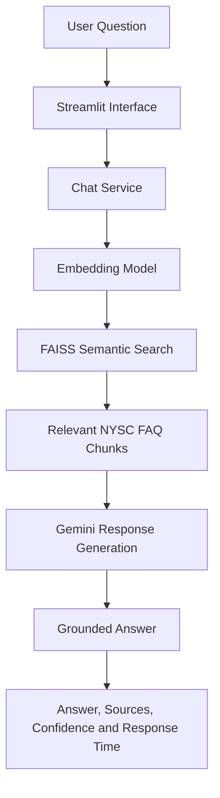
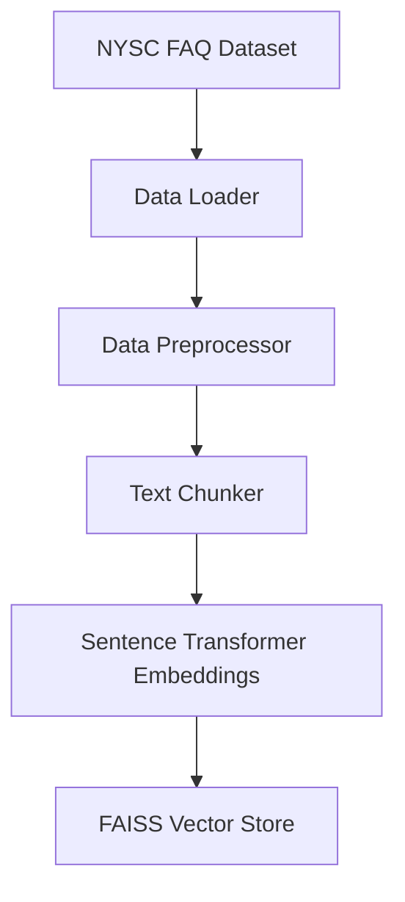

# NYSC FAQ Chatbot

## Project Description

NYSC FAQ Chatbot is a Retrieval-Augmented Generation (RAG) application that
provides clear, source-grounded answers to frequently asked questions about
the National Youth Service Corps (NYSC). It combines semantic retrieval from a
verified FAQ knowledge base with Google Gemini response generation.

This is an independent educational project and is not an official NYSC
platform.

## Problem Statement

Prospective and serving corps members often need to consult multiple sources
to find reliable guidance about registration, mobilization, the Senate list,
orientation camp, relocation, Place of Primary Assignment (PPA), Community
Development Service (CDS), monthly clearance, exemption, passing out, and
portal problems. Information can be difficult to locate, unclear, or
time-sensitive. This project provides a single conversational interface for
retrieving relevant, verified FAQ information and displaying its official
sources.

## Project Objectives

- Provide clear NYSC information.
- Retrieve semantically relevant FAQs.
- Generate answers grounded in retrieved context.
- Display official information sources.
- Reject unrelated or insufficiently supported questions.
- Reduce hallucination by restricting generation to retrieved evidence.
- Provide a simple and accessible user interface.

## Key Features

- Retrieval-Augmented Generation pipeline
- Semantic FAQ search
- FAISS vector database
- Sentence Transformer embeddings
- Google Gemini-generated responses
- Official source citations
- Retrieval confidence scores
- Response-time tracking
- Conversation history
- Suggested questions
- Clear-conversation functionality
- Application logging
- Retriever evaluation report
- Streamlit interface

## System Architecture

### Question-answering pipeline



### Knowledge-base pipeline



## Retrieval Workflow

1. The user submits an NYSC-related question through the Streamlit interface.
2. The application cleans the question and generates a normalized embedding
   with `all-MiniLM-L6-v2`.
3. FAISS compares the question embedding with the stored FAQ embeddings.
4. The three most relevant FAQ chunks are returned with similarity-based
   confidence scores.
5. Questions without a sufficiently confident match receive a safe
   unavailable-information response.
6. Relevant FAQ chunks are formatted as context for Gemini.
7. Gemini generates a concise answer restricted to the retrieved context.
8. The interface displays the answer, confidence, response time, and official
   sources.

## Project Structure

```text
nysc-faq-chatbot/
├── app/
│   └── app.py
├── assets/
├── data/
│   ├── faq/
│   │   └── nysc_faq.json
│   ├── processed/
│   │   └── evaluation_questions.json
│   └── raw/
├── logs/
├── notebooks/
├── reports/
│   └── evaluation_report.json
├── src/
│   ├── __init__.py
│   ├── chat_engine.py
│   ├── chat_service.py
│   ├── data_loader.py
│   ├── data_preprocessor.py
│   ├── embedding_model.py
│   ├── evaluator.py
│   ├── logger.py
│   ├── retriever.py
│   ├── text_chunker.py
│   ├── validate_faq.py
│   └── vector_store.py
├── tests/
│   └── __init__.py
├── vector_store/
│   ├── metadata.json
│   └── nysc_faq.index
├── .env.example
├── .gitignore
├── main.py
├── README.md
└── requirements.txt
```

## Installation

The following instructions use Windows PowerShell.

1. Clone the repository using its GitHub URL:

   ```powershell
   git clone YOUR_REPOSITORY_URL
   ```

2. Enter the project directory:

   ```powershell
   cd nysc-faq-chatbot
   ```

3. Create the project virtual environment:

   ```powershell
   python -m venv NYSCHATBOT
   ```

4. Activate the virtual environment:

   ```powershell
   NYSCHATBOT\Scripts\activate
   ```

5. Upgrade pip:

   ```powershell
   python -m pip install --upgrade pip
   ```

6. Install the project requirements:

   ```powershell
   python -m pip install -r requirements.txt
   ```

## Environment Configuration

Create a local `.env` file from `.env.example`:

```powershell
Copy-Item .env.example .env
```

Update `.env` with your own Gemini configuration:

```text
GEMINI_API_KEY=your_gemini_api_key_here
GEMINI_MODEL=the_supported_gemini_model_name
```

Never commit `.env` or expose a real API key.

## Build the Vector Store

Run the vector-store builder after creating or updating the FAQ knowledge
base:

```powershell
python -m src.vector_store
```

This command prepares the FAQ documents, generates normalized embeddings, and
creates the local FAISS index and aligned JSON metadata in `vector_store/`.

## Run the Application

Start the Streamlit application from the project root:

```powershell
python -m streamlit run app/app.py
```

## Testing and Validation

Run the following commands from the project root:

```powershell
python src/validate_faq.py
python -m src.data_preprocessor
python -m src.text_chunker
python -m src.embedding_model
python -m src.retriever
python -m src.evaluator
```

The retriever evaluation does not call Gemini.

## Evaluation Results

The confirmed semantic-retriever evaluation results are:

| Metric | Result |
|---|---:|
| Total questions | 20 |
| Correct results | 18 |
| Incorrect results | 2 |
| Retrieval accuracy | 90.00% |
| Average confidence | 83.46% |
| Average response time | 0.04 seconds |

Evaluation results may change after the knowledge base, embedding model, or
vector store is updated.

## Example Questions

- How do I register for NYSC?
- What documents should I take to orientation camp?
- How can I apply for relocation?
- What is a PPA in NYSC?
- What is monthly clearance?
- What documents do foreign-trained graduates need?

## Safety and Limitations

- This chatbot is an independent educational project, not an official NYSC
  platform.
- NYSC information, procedures, and schedules may change.
- Users should verify time-sensitive information through official NYSC
  channels.
- Response quality depends on the coverage and accuracy of the knowledge
  base.
- Gemini responses are restricted by the FAQ context retrieved for each
  question.
- The application does not provide legal, medical, or financial advice.

## Future Improvements

- Expand the verified FAQ knowledge base.
- Add ingestion of official NYSC PDF documents.
- Add multilingual support.
- Add voice interaction.
- Improve evaluation with structured human review.
- Add an administrative knowledge-base management interface.
- Add automated monitoring for official source updates.

## Author

**Palmer Ogiriki**

AI/ML Capstone Project

## License

This project uses the MIT License.
