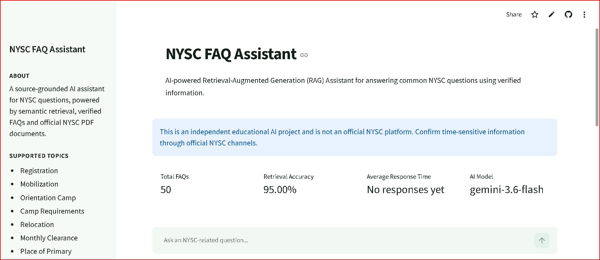
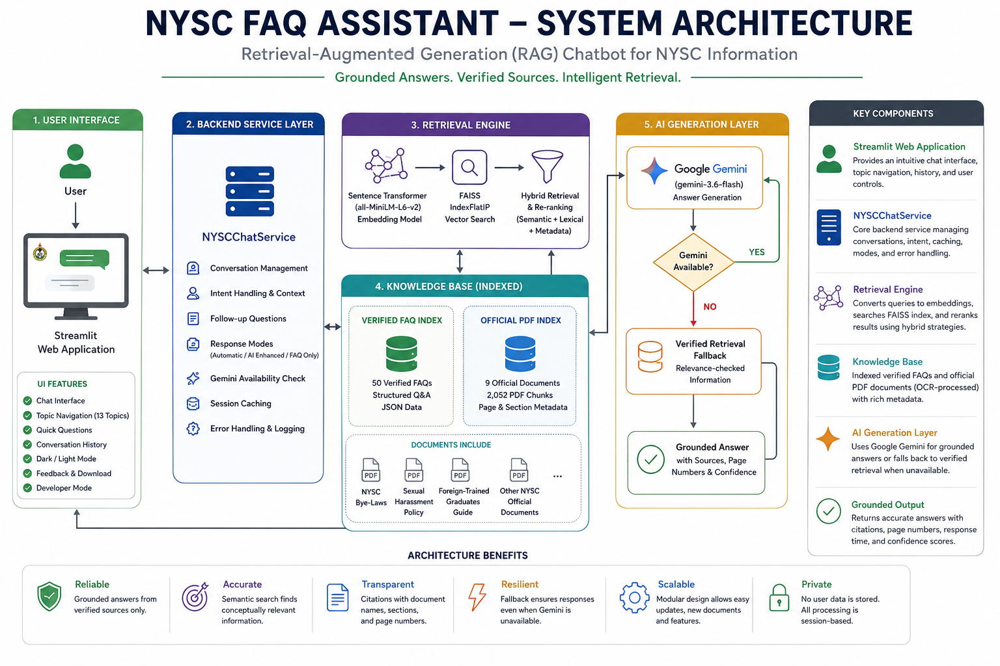
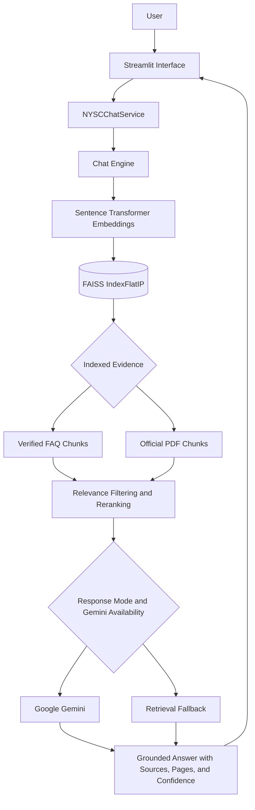
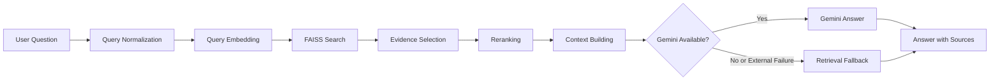
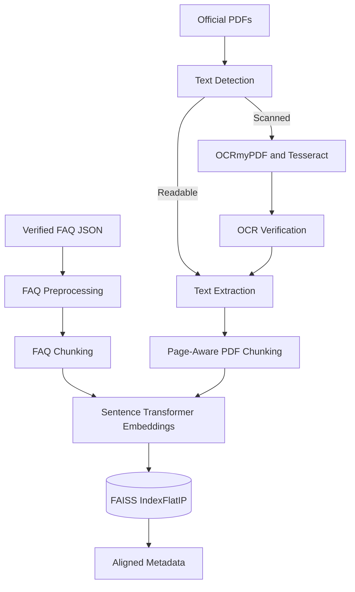
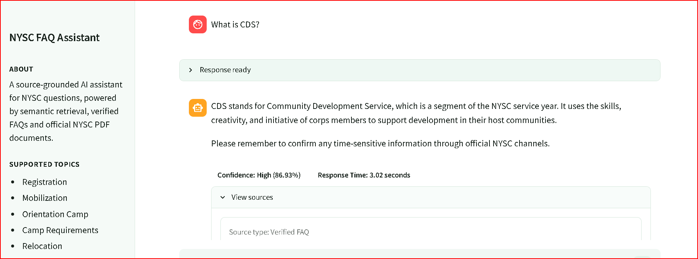
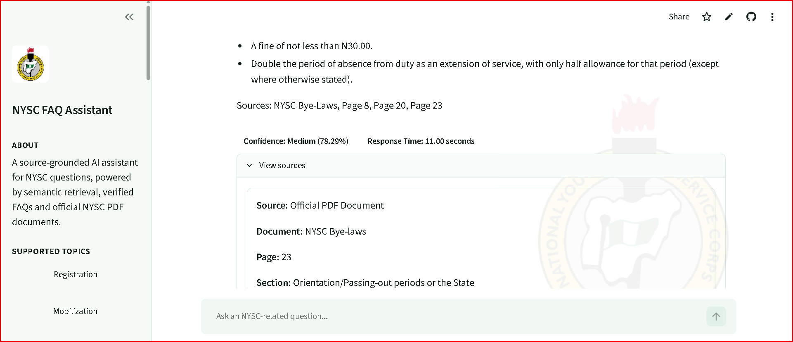
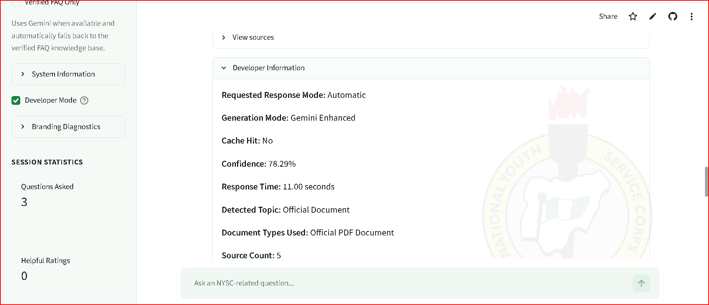
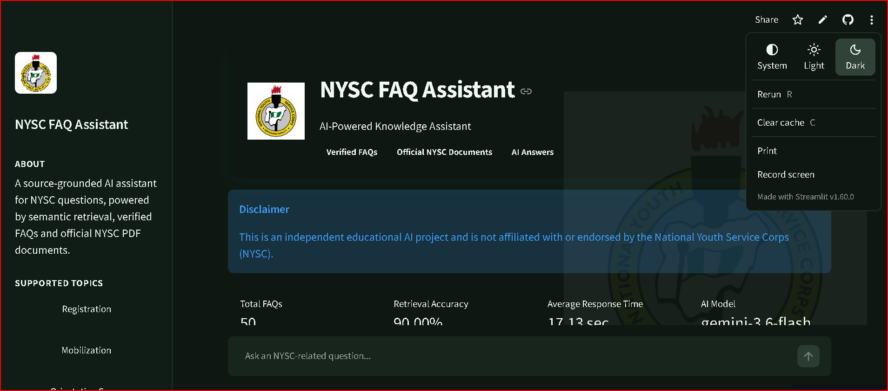
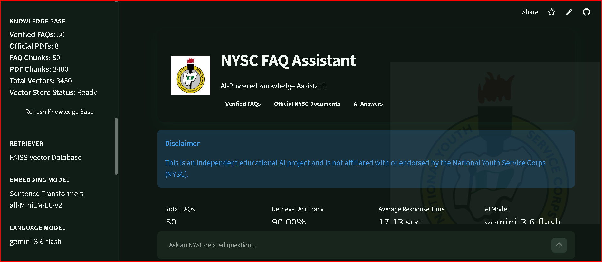

<div align="center">

# NYSC FAQ Assistant

An AI-powered Retrieval-Augmented Generation assistant for National Youth Service Corps questions, grounded in verified FAQs and official NYSC documents.

<p>
  <a href="https://www.python.org/"></a>
  <a href="https://streamlit.io/"></a>
  <a href="https://github.com/facebookresearch/faiss"></a>
  <a href="https://ai.google.dev/"></a>
  <a href="https://www.sbert.net/"></a>
  <a href="LICENSE"></a>
  
</p>

[Live Demo](https://nysc-faq-assistant.streamlit.app/) · [Repository](https://github.com/AnalyticPalmer/nysc-faq-chatbot)



</div>

> [!IMPORTANT]
> This is an independent educational AI project and is not affiliated with or endorsed by the National Youth Service Corps (NYSC).

## Table of Contents

- [Live Demo](#live-demo)
- [Project Overview](#project-overview)
- [Key Features](#key-features)
- [Supported Topics](#supported-topics)
- [Project Statistics](#project-statistics)
- [System Architecture](#system-architecture)
- [Document Ingestion Pipeline](#document-ingestion-pipeline)
- [Technology Stack](#technology-stack)
- [Project Structure](#project-structure)
- [Installation](#installation)
- [Usage](#usage)
- [Response Modes](#response-modes)
- [Application Screenshots](#application-screenshots)
- [Evaluation](#evaluation)
- [Engineering Challenges](#engineering-challenges)
- [Security and Reliability](#security-and-reliability)
- [Limitations](#limitations)
- [Future Improvements](#future-improvements)
- [Skills Demonstrated](#skills-demonstrated)
- [Author](#author)
- [License](#license)

## Live Demo

- **Live Streamlit application:** [nysc-faq-assistant.streamlit.app](https://nysc-faq-assistant.streamlit.app/)
- **GitHub repository:** [github.com/AnalyticPalmer/nysc-faq-chatbot](https://github.com/AnalyticPalmer/nysc-faq-chatbot)

## Project Overview

NYSC guidance spans registration, mobilization, orientation, service obligations, portal support, Bye-Laws, and policy documents. Finding a reliable answer can require searching several sources, while exact keyword search may miss relevant information when a user's wording differs from the source.

The assistant uses `sentence-transformers/all-MiniLM-L6-v2` to encode questions and knowledge-base chunks by meaning. Normalized vectors are searched through FAISS `IndexFlatIP`, allowing semantically related evidence to surface even without an exact phrase match. The chat engine then filters and reranks FAQ and PDF results using similarity, meaningful term overlap, source type, document-title matches, FAQ-question matches, and page metadata.

Answers are grounded in verified FAQ records and indexed official NYSC documents. When available, Google Gemini converts selected evidence into a concise response under strict grounding and citation instructions. If Gemini cannot be initialized or an external generation request fails, the application returns a relevance-checked retrieval fallback instead of fabricating an answer.

## Key Features

### AI and Retrieval

- Retrieval-Augmented Generation with bounded source context
- Google Gemini generation (`gemini-3.6-flash` by default)
- Semantic search with Sentence Transformers
- Normalized `all-MiniLM-L6-v2` embeddings
- FAISS `IndexFlatIP` similarity search
- Relevance filtering, deduplication, and hybrid reranking
- Verified retrieval fallback when Gemini is unavailable

### Knowledge Base

- 50 verified NYSC FAQ records
- Eight official NYSC PDFs
- OCR-processed NYSC Bye-Laws
- NYSC sexual harassment policy
- Registration guidance for foreign-trained prospective corps members
- Page-aware and section-aware PDF citations

### OCR Workflow

- Offline scanned-document detection with PyMuPDF
- OCRmyPDF and Tesseract processing
- OCR output verification before ingestion
- Automatic skipping of readable PDFs and existing OCR outputs
- No OCR execution during normal Streamlit startup

> [!NOTE]
> `ocr_scanned_pdfs.py` imports PyMuPDF (`fitz`) and invokes OCRmyPDF. These optional OCR dependencies are not currently listed in `requirements.txt`, and OCRmyPDF requires an external Tesseract installation.

### User Experience

- Theme-aware light and dark modes
- Responsive desktop and mobile layout
- Conversation history and follow-up suggestions
- Confidence and response-time display
- FAQ and PDF citations with page and section metadata
- Sidebar topic navigation for 13 NYSC topics
- Quick questions and suggested topic questions
- Conversation download and feedback controls
- Developer Mode diagnostics

### Engineering

- Modular interface, service, retrieval, generation, and ingestion layers
- Structured logging and defensive error handling
- In-session response caching
- Conversational follow-up detection
- Cached Streamlit resources and statistics
- Automatic, AI Enhanced, and Verified FAQ Only response modes
- Local-only vector-store refresh control

## Supported Topics

- Registration
- Mobilization
- Orientation Camp
- Camp Requirements
- Relocation
- Monthly Clearance
- Place of Primary Assignment
- Community Development Service
- Passing Out
- Exemption
- Foreign-Trained Graduates
- Portal Support
- NYSC Bye-Laws and Official Documents

## Project Statistics

Values below were verified from the current FAQ data, `data/raw`, vector metadata, source configuration, and evaluation report.

| Metric | Current value |
|---|---:|
| Verified FAQs | 50 |
| Official PDF files | 8 |
| FAQ chunks | 50 |
| PDF chunks | 3,400 |
| Total indexed vectors | 3,450 |
| Embedding dimension | 384 |
| Evaluation questions | 20 |
| Retrieval accuracy | 90.00% |
| Average confidence | 72.89% |
| Average response time | 0.06 seconds |

## System Architecture

The architecture separates the Streamlit interface, service layer, chat engine, retrieval engine, indexed knowledge base, Gemini generation path, and verified retrieval fallback.



### Technical Flow



### System Workflow



## Document Ingestion Pipeline

OCR is an offline preparation step. It does not run during normal Streamlit startup or as part of public question answering.



The OCR-generated Bye-Laws document is present in the ingestion directory with a searchable text layer. Normal PDF loading skips unreadable image-only files rather than creating OCR outputs during application startup.

## Technology Stack

| Area | Technology | Purpose |
|---|---|---|
| Frontend | Streamlit 1.60 | Chat interface, topic navigation, source cards, session controls, and diagnostics |
| Backend | Python | Service orchestration, validation, preprocessing, logging, and evaluation |
| Generative AI | Google Gemini through `google-genai` | Grounded natural-language response generation |
| Embeddings | Sentence Transformers, PyTorch | Semantic text representation |
| NLP model | `sentence-transformers/all-MiniLM-L6-v2` | 384-dimensional normalized embeddings |
| Vector search | FAISS `IndexFlatIP` | Inner-product search over normalized knowledge-base vectors |
| PDF extraction | pypdf | Page-level extraction from readable PDFs |
| Offline OCR | OCRmyPDF, Tesseract, PyMuPDF | Scan detection, OCR processing, and output verification |
| Data | JSON, NumPy | FAQ records, metadata, reports, and embedding arrays |
| Deployment | Streamlit Community Cloud | Hosted application |

## Project Structure

The structure below includes repository files plus the new architecture and screenshot assets required by this README. Local virtual environments, caches, logs, and ignored secrets are omitted.

```text
nysc-faq-chatbot/
├── .streamlit/
│   └── config.toml
├── app/
│   ├── assets/
│   │   └── nysc_logo.png
│   └── app.py
├── assets/
│   ├── diagrams/
│   │   └── system-architecture.png
│   └── screenshots/
│       ├── dark-mode.png
│       ├── developer-mode.png
│       ├── faq-answer.png
│       ├── home.png
│       ├── knowledge-base.png
│       ├── nysc_logo.png
│       └── pdf-answer.png
├── data/
│   ├── faq/
│   │   └── nysc_faq.json
│   ├── ocr/
│   │   └── nyscbyelawschedule_ocr.pdf
│   ├── processed/
│   │   └── evaluation_questions.json
│   └── raw/
│       ├── electoralconductguide.pdf
│       ├── NYSC_POLICY_on_sexual_harassment.pdf
│       ├── nyscbyelawschedule_ocr.pdf
│       ├── nyscdecree.pdf
│       ├── Registration Requirements for Foreign Prospective Corp Members.pdf
│       ├── THE NATIONAL YOUTH SERVICE CORPS & NATIONAL DEVELOPMENT.pdf
│       ├── THE NATIONAL YOUTH SERVICE CORPS AND COMMUNITY DEVELOPMENT SERVICE IN NIGERIA.pdf
│       └── THE NATIONAL YOUTH SERVICE CORPS AND NATIONAL INTEGRATION.pdf
├── reports/
│   └── evaluation_report.json
├── src/
│   ├── __init__.py
│   ├── chat_engine.py
│   ├── chat_service.py
│   ├── data_loader.py
│   ├── data_preprocessor.py
│   ├── embedding_model.py
│   ├── evaluator.py
│   ├── logger.py
│   ├── pdf_loader.py
│   ├── pdf_preprocessor.py
│   ├── retriever.py
│   ├── text_chunker.py
│   ├── validate_faq.py
│   └── vector_store.py
├── tests/
│   └── __init__.py
├── vector_store/
│   ├── metadata.json
│   └── nysc_faq.index
├── .env.example
├── .gitattributes
├── .gitignore
├── diagnose_bylaws_pdf.py
├── LICENSE
├── main.py
├── ocr_scanned_pdfs.py
├── README.md
├── requirements.txt
└── test_pdf.py
```

## Installation

The following commands target Windows PowerShell.

### 1. Clone the repository

```powershell
git clone https://github.com/AnalyticPalmer/nysc-faq-chatbot.git
cd nysc-faq-chatbot
```

### 2. Create and activate the virtual environment

```powershell
python -m venv NYSCHATBOT
NYSCHATBOT\Scripts\Activate.ps1
```

### 3. Install application requirements

```powershell
python -m pip install -r requirements.txt
```

### 4. Configure Gemini

```powershell
Copy-Item .env.example .env
```

Use placeholders until valid credentials and a supported model are available:

```dotenv
GEMINI_API_KEY=your_api_key_here
GEMINI_MODEL=your_supported_gemini_model
```

Never commit `.env` or a real API key.

### 5. Build the vector store

The repository contains an index and aligned metadata. Rebuild only after intentionally changing the knowledge base:

```powershell
python -m src.vector_store
```

### 6. Run Streamlit

```powershell
python -m streamlit run app/app.py
```

### Offline OCR Workflow

Install PyMuPDF, OCRmyPDF, Tesseract, and their system prerequisites using their official platform instructions before running the optional OCR workflow. These dependencies are not all declared in `requirements.txt`.

```powershell
python ocr_scanned_pdfs.py
python diagnose_bylaws_pdf.py
python -m src.vector_store
```

`ocr_scanned_pdfs.py` reads PDFs from `data/raw` and writes OCR outputs to `data/ocr`. Review an OCR output before moving the intended searchable version into the ingestion set and rebuilding the vector store. OCR does not run automatically on Streamlit Cloud.

## Usage

Choose a supported topic, select a suggested question, use a quick-question shortcut, or type directly into the chat input.

| Topic | Example question |
|---|---|
| Registration | How do I correct a mistake in my registration? |
| Orientation Camp | What documents should I take to orientation camp? |
| Place of Primary Assignment | What is a PPA in NYSC? |
| Community Development Service | Is CDS compulsory? |
| NYSC Bye-Laws | What offences can lead to extension of service? |
| Foreign-Trained Graduates | What documents should a foreign-trained graduate present? |
| Sexual Harassment Policy | What does the NYSC sexual harassment policy say? |

Successful responses can display confidence, response time, source type, document name, page number, section title, generation mode, and cache status.

## Response Modes

| Mode | Current behavior |
|---|---|
| **Automatic** | Default. Uses Gemini when available and falls back to a relevance-checked retrieved answer when Gemini is unavailable or an external generation call fails. |
| **AI Enhanced** | Requests a Gemini-generated response grounded in selected evidence. External Gemini failures still use the verified retrieval fallback. |
| **Verified FAQ Only** | Does not call Gemini. The current implementation selects the strongest relevant retrieved evidence, which can be a verified FAQ or an official PDF despite the UI label. |

## Application Screenshots

### Home Interface


### Verified FAQ Answer



### Official PDF Answer



### Developer Mode



### Dark Mode



### Knowledge Base Overview



No dedicated Topic Navigation screenshot is currently present in `assets/screenshots`.

## Evaluation

`reports/evaluation_report.json` records top-result category accuracy for the 20 questions in `data/processed/evaluation_questions.json`. The evaluator measures semantic retrieval and does not call Gemini.

| Metric | Recorded value |
|---|---:|
| Questions | 20 |
| Correct top-category results | 18 |
| Incorrect top-category results | 2 |
| Accuracy | 90.00% |
| Average confidence | 72.89% |
| Average response time | 0.06 seconds |

The two recorded category mismatches concern married-corps-member relocation and original-document requirements for foreign-trained graduates. Results may change after updating documents, rebuilding the vector store, changing retrieval logic, or rerunning evaluation.

```powershell
python -m src.evaluator
```

This command overwrites `reports/evaluation_report.json` with the newly measured results.

## Engineering Challenges

### Scanned PDF and OCR Processing

Official information may arrive as image-based PDFs. The project keeps detection and OCR offline, verifies generated text, and preserves page-aware metadata while preventing public startup from initiating OCR.

### Retrieval Ranking and FAQ Dominance

Vector similarity can favor short FAQ records over longer official-document chunks. The chat engine widens retrieval, normalizes scores, filters weak evidence, applies explainable reranking bonuses, deduplicates chunks, and limits repetitive context from one source.

### Gemini Quota and API Fallback

Authentication, quota, rate-limit, timeout, connection, and service errors are treated as external generation failures. Relevant retrieved evidence is returned through a safe fallback path.

### Session Caching and Follow-Up Detection

Normalized cache keys include response mode. The service tracks the last topic, expands likely follow-up queries with that context, and avoids caching unavailable, related-but-unclear, or failed responses.

### Source Display

FAQ sources retain official links, while PDF source cards show a readable document name and optional page and section citations without exposing filesystem paths.

### Grounded Generation

Gemini receives a bounded evidence context and explicit instructions not to add unsupported facts or citations. Insufficient evidence produces a controlled unavailable or related-but-unclear response.

## Security and Reliability

- Secrets are loaded from environment variables through `python-dotenv`.
- `.env` is ignored by Git, and `.env.example` contains placeholders.
- No API key is committed or displayed by the application.
- External Gemini errors are handled without returning sensitive exception details.
- Gemini generation is restricted to retrieved evidence.
- Verified retrieval fallback remains available without Gemini.
- Source cards do not expose local, deployment, Windows, or Linux paths.
- Missing and malformed source records are handled defensively.
- Public users cannot rebuild the vector store through the interface.
- OCR and vector-store rebuilding are not normal public startup operations.

## Limitations

- The project is not an official NYSC platform.
- NYSC policies, schedules, requirements, and portal behavior can change.
- Knowledge coverage is limited to the indexed FAQ and document collection.
- OCR accuracy depends on scan quality, layout, rotation, and resolution.
- Gemini quotas, rate limits, and service availability may affect AI-enhanced responses.
- Retrieval confidence is a similarity-derived indicator, not a guarantee of correctness.

## Future Improvements

- Administrative document-management dashboard
- Automated official-document update pipeline
- Cross-encoder retrieval reranking
- Voice input and spoken responses
- Multilingual support
- Docker-based development and deployment
- CI/CD for syntax, retrieval evaluation, and deployment
- Persistent analytics and feedback reporting

## Skills Demonstrated

- Python
- Streamlit
- Retrieval-Augmented Generation
- Semantic search
- FAISS
- Sentence Transformers
- Google Gemini API
- OCR
- Prompt engineering
- Document processing
- Software architecture
- Git and GitHub
- Technical documentation

## Author

**Palmer Ogiriki**<br>
AI and Machine Learning Engineer

- GitHub: [@AnalyticPalmer](https://github.com/AnalyticPalmer)

## License

This project is licensed under the [MIT License](LICENSE).

Copyright © 2026 Palmer Ogiriki.
